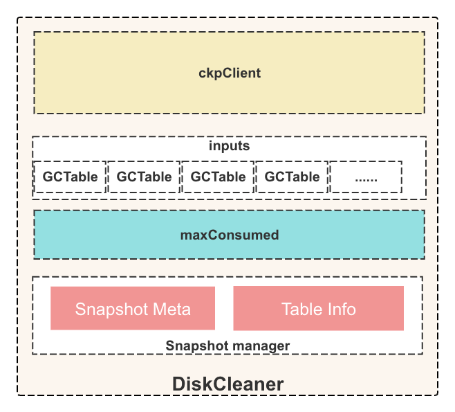
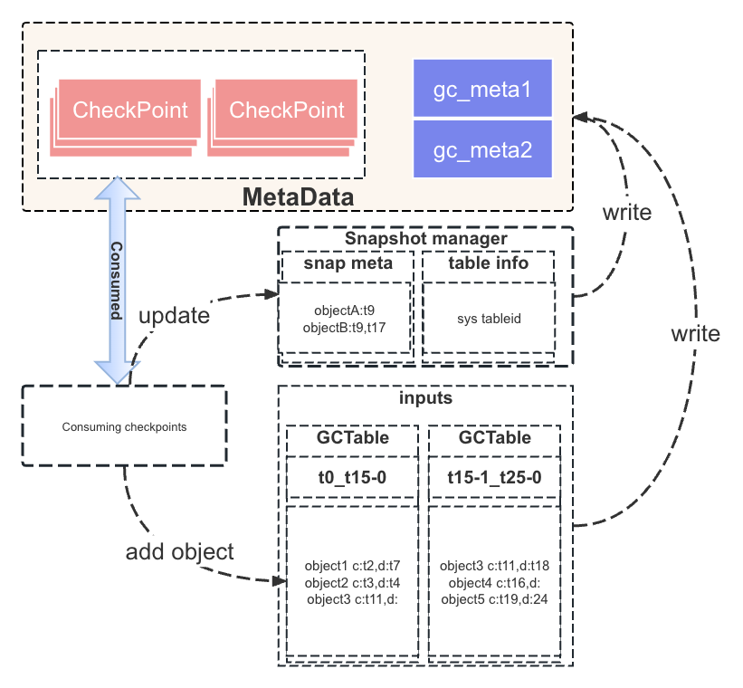
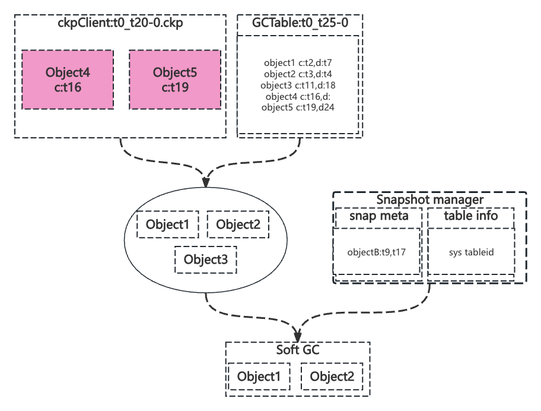

# GC supports Snapshot&PITR

# **Introduction**
在MO中，Snapshot是一个时间点，可以看做一个TS，用户可以对租户或集群打快照，其实就是让MO记录一个个TS，这些TS被存储再一个名叫mo_snapshots的表中， 用户可以通过这些TS读取历史数据。
PITR是指定一个时间周期，用户可以读取到这个时间段内的所有数据。 MO的Snapshot功能主要是通过一个Snapshot Read而实现的，MO原生支持读取
某一个TS的历史数据，所以需要读取的数据和元数据不被删除就可以快是支持MO的Snapshot模块。

GC模块是MO中一个重要的模块，负责定期清理MO过期的历史数据和元数据。
所以GC模块需要感知Snapshot&PITR的存在，在定期清理历史数据的时候可以 跳过这些被引用的数据，不被删除。
当指定Snapshot被drop后，再正常清理这种被引用的历史数据。

# **Architecture Design**

## Overview


GC Scheduler是一个定时任务，定期向GC队列中发送任务，立即返回。
DiskCleaner就是GC的执行实例，接受到任务后， 开始消费MO满足条件的Checkpoint，分析期间Create和Soft Delete的object并存储一个增量的
GC meta对象， 然后计算得出满足GC的object执行Delete Data和Checkpoint的操作。

```shell
Shard
├── ckp
│   ├── meta_0-0_1719845767752964820-1.ckp
│   ├── meta_1719845767752964820-1_1719845878597550780-0.ckp
│   ├── meta_1719845878597550780-1_1719845943596456990-0.ckp
│   └── ....
├── gc
│   ├── gc_1719887988600647826-1_1719888043599304554-0.fgc
│   ├── gc_1719888043599304554-1_1719888158596187708-0.ckp
│   ├── gc_1719888158596187708-1_1719888268596129715-0.ckp
│   └── ....

ckp: checkpoint的元数据，记录了checkpoint的位置信息。
gc: gc的meta，记录了一段时间create的object。
```

## Key Design

对于GC，主要有4个步骤：


1. 定时器启动，出发GC操作，消费MO的Checkpoint。
2. 分析Checkpoint，维护内存结构，生成GC meta，更新水位。
3. 计算需要删除的数据，执行Delete Data操作。
4. 处理GC meta，比如merge meta，删除meta。

# **Feature Detail Design**

### **DiskCleaner overview**




1. ckpClient: 是一个client，是DiskCleaner用于获取当前水位之后的checkpoint entry。使用checkpoint entry可以读取checkpoint的数据。
2. GCTable: 是一个map，用与存储一次性消费checkpoint后新添加的object，key是object的name，value记录了object的一些信息: create time, delete time, table id等。
3. maxConsumed: 是DiskCleaner的水位，会记录消费的checkpoint水位，删除数据的水位，gc meta merge的水位等。
4. Snapshot manager: 是一个manager，用于管理snapshot和table的信息。比如mo_snapshots表存储的object，MO所有的table信息。

### **Sample**
```shell
Shard
├── ckp
│   ├── t0_t5-0.ckp
│   ├── t5-1_t10-0.ckp
│   ├── t10-1_t15-0.ckp
│   └── t15-1_t20-0.ckp
│   ├── t0_t20-0.ckp  // global checkpoint
│   └── t20-1_t25-0.ckp
```

<table>
  <tr>
   <td><strong>Object Name</strong>
   </td>
   <td><strong>Create TS</strong>
   </td>
   <td><strong>Drop TS</strong>
   </td>
  </tr>
  <tr>
   <td>object1
   </td>
   <td>t2
   </td>
   <td>t7
   </td>
  </tr>
  <tr>
   <td>object2
   </td>
   <td>t3
   </td>
   <td>t4
   </td>
  </tr>
  <tr>
   <td>object3
   </td>
   <td>t11
   </td>
   <td>t18
   </td>
  </tr>
  <tr>
   <td>object4
   </td>
   <td>t16
   </td>
   <td>
   </td>
  </tr>
  <tr>
   <td>object5
   </td>
   <td>19
   </td>
   <td>t24
   </td>
  </tr>
</table>

<table>
  <tr>
   <td><strong>Snapshot</strong>
   </td>
   <td><strong>Snapshot TS</strong>
   </td>
   <td><strong>Account</strong>
   </td>
  </tr>
  <tr>
   <td>snapshot1
   </td>
   <td>t9
   </td>
   <td>sys
   </td>
  </tr>
  <tr>
   <td>snapshot2
   </td>
   <td>t17
   </td>
   <td>sys
   </td>
  </tr>
</table>

### **Consuming checkpoints**



定时器定时触发一次GC操作，Cleaner会根据水位消费指定的checkpoint,
从这些checkpoint中分析出新添加的object、mo_snapshots表的object和create/drop table信息，分别添加和更新到GCTable和Snapshot Meta中。
之后再写入GC meta，用于replay，最后更新水位。

1. 定时器每30分钟触发一次GC操作。
2. Cleaner只会消费1小时之前的checkpoint，代表MO一小时内所有的历史都肯定不会被GC。
3. Object会记录create TS和Drop TS，TableID等信息。
4. DDL中Table的Create和Drop也会记录到Snapshot的Table Info中。
5. mo_snapshots表不会被打快照，所以Snapshot Meta中的Object信息可及时更新。
6. GCTable会不停的merge，通常inputs中只会保留一个GCTable，记录了所有的object信息。

### **Soft GC**



进入Soft GC阶段，Cleaner会根据GCTable中的object信息和最近的Global Checkpoint，计算出需要删除的object，并且判断是否有Snapshot引用，
然后执行Delete Data操作。

1. Cleaner总是拿到Max的Global Checkpoint。
2. 消费过后会更新水位，记录上次GC的Global Checkpoint，无更新则不会执行Soft GC操作。
3. GCTable中的object如果不存在与Global Checkpoint中，会被判断为需要删除的object。
4. 要删除的object会有create和drop TS，如果drop TS为空，代表object还在使用中，不会被删除。
5. 要删除的object会二分查找Snapshot List，如果有Snapshot引用，不会被删除。判断规则是create和drop是否跨越Snapshot的TS。

### **GC Meta**