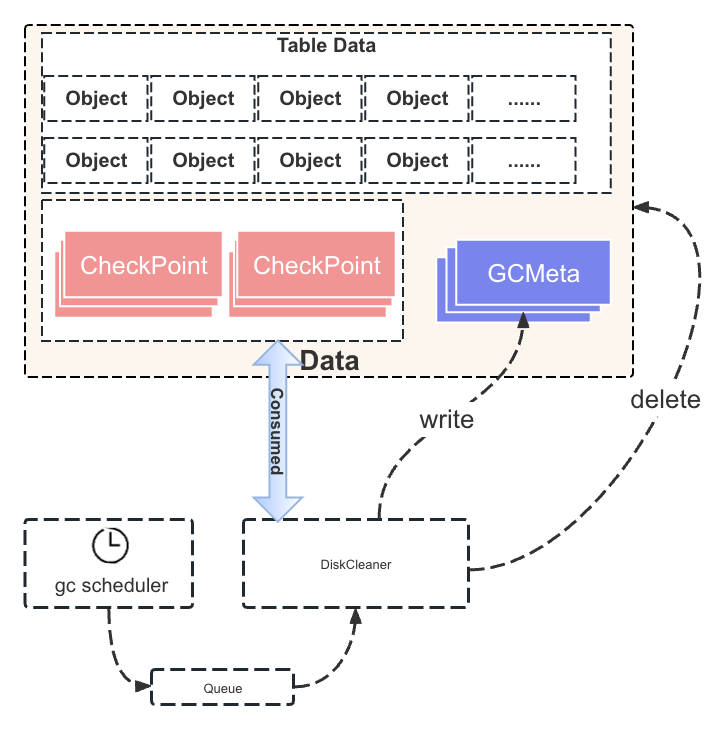

# GC supports Snapshot&PITR

# **Introduction**
在MO中，Snapshot是一个时间点，可以看做一个TS，用户可以对租户或集群打快照，其实就是让MO记录一个个TS，用户可以通过这个TS读取历史数据。
PITR是指定一个时间周期，用户可以读取到这个时间段内的所有数据。 MO的Snapshot功能主要是通过一个Snapshot Read而实现的，MO原生支持读取
某一个TS的历史数据，所以需要读取的数据和元数据不被删除就可以快是支持MO的Snapshot模块。

GC模块是MO中一个重要的模块，负责定期清理MO过期的历史数据和元数据。
所以GC模块需要感知Snapshot&PITR的存在，在定期清理历史数据的时候可以 跳过这些被引用的数据，不被删除。
当指定Snapshot被drop后，再正常清理这种被引用的历史数据。

# **Architecture Design**

## Overview




GC Scheduler是一个定时任务，定期向GC队列中发送任务，立即返回。
DiskCleaner就是GC的执行实例，接受到任务后， 开始消费MO满足条件的Checkpoint，分析期间Create和Soft Delete的object并存储一个增量的
GC meta对象， 然后计算得出满足GC的object执行Delete Data和Checkpoint的操作。

```shell
Shard
├── ckp
│   ├── meta_0-0_1719845767752964820-1.ckp
│   ├── meta_1719845767752964820-1_1719845878597550780-0.ckp
│   ├── meta_1719845878597550780-1_1719845943596456990-0.ckp
│   └── ....
├── gc
│   ├── gc_1719887988600647826-1_1719888043599304554-0.fgc
│   ├── gc_1719888043599304554-1_1719888158596187708-0.ckp
│   ├── gc_1719888158596187708-1_1719888268596129715-0.ckp
│   └── ....

ckp: checkpoint的元数据，记录了checkpoint的位置信息。
gc: gc的meta，记录了一段时间create的object。
```
