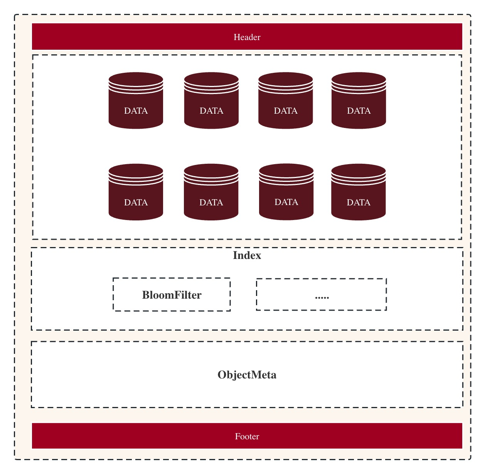
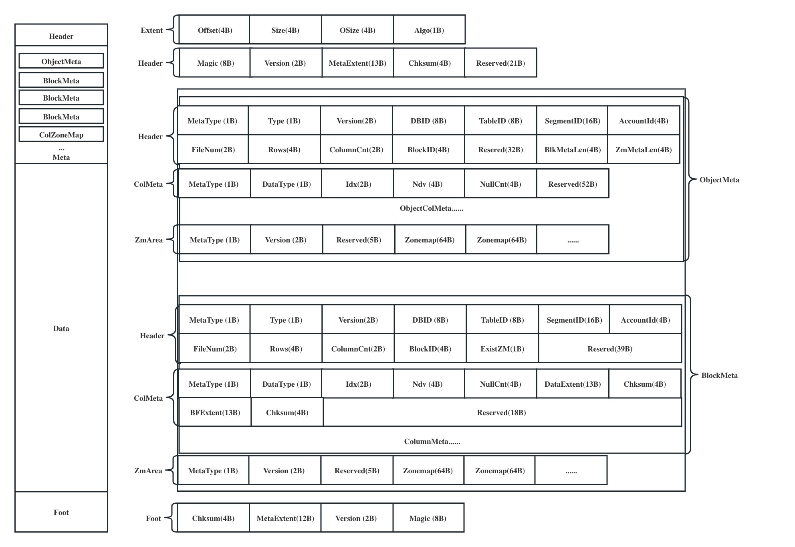

# MatrixOne Layout


MatrixOne从0.5设计开始就已经确定采用列存结构来存储数据集，原因如下：
```go
1.很容易对AP优化

2.通过引入Column Family的概念可以对负载灵活适配。假如所有列都是一个Column Family，
也就是所有的列数据保存在一起，这就跟数据库的HEAP文件非常类似，可以表现出行存类似的行为，
典型的OLTP数据库如PostgreSQL就是基于HEAP来做的存储引擎。假如每个列都是独立的Column Family，
也就是每一列都独立存放，那么就是典型的列存。通过定义Column Family，用户可以方便地在行存和列存之间切换，这只需要在DDL表定义中指定即可。
```


### Part 1 Layout需要满足的条件和解决了什么问题
设计一种Layout，首先要提出一个疑问。
```go
我们到底需要满足什么功能和需求？
```
对于MatrixOne来说，需要存储的数据类型有很多种，比如：数据库表数据、元数据、数据库业务trace log、查询结果的cache...
```go
功能1：支持存储MatrixOne所有的业务类型数据。
```
MatrixOne需对接S3或共享对象存储，每一个对象需要存储指定行数或Size的存储集，所以一个对象会存储多个IO单元（IOEntry），在此时我们称之为Block。
这些Block需要高效读取和管理，比如一个查询需要读取哪些Block，首先需要拿到Block的元数据并分析，然后再根据这些Block的元数据得到真正数据的存放地址并读取。
```go
功能2：便捷高效的元数据
```
当MatrixOne运行一段时间，客户需求不断增加，这时不得不修改当前的Layout。
```go
功能3：支持数据的版本兼容和控制
```
支持数据分析工具和添加Scrub任务
```go
功能4：支持从数据对象文件中重建MatrixOne的表结构
```
根据以上需求我们得出现有的Layout结构


### Part 2 解析这些结构
#### Extent
在MatrixOne中，Extent负责记录一个IOEntry的位置信息。
```
+------------+----------+-------------+-------------+
| Offset(4B) | Size(4B) |  OSize (4B) |  Algo (1B)  |
+------------+----------+-------------+-------------+

Offset = IOEntry的起始地址
Size = IOEntry存储在对象中的大小
oSize = IOEntry压缩前的原始大小
Algo = 压缩算法类型
```
#### BlockMeta
#### ObjectMeta
为什么我们先介绍ObjectMeta而不是Header，因为MatrixOne的查询业务是从ObjectMeta开始的。
MatrixOne向S3写入数据成功后，会拿到一个记录ObjectMeta位置的Extent，并保存到Catalog中。
当MatrixOne执行查询操作需要读取数据时，可以通过这个Extent拿到ObjectMeta，从而拿到Block的真实数据。

ObjectMeta由多个BlockMeta、一个MetaHeader、一个BlockIndex组成。
MetaHeader和BlockMeta结构一致，用来记录整个Object的全局信息，比如dbID，TableID，ObjectName和Object全局数据的的ZoneMap、Ndv、nullCut等等。

BlockIndex记录后面每一个BlockMeta的地址。ObjectMeta在MatrixOne系统中使用非常频繁，
虽然每一个BlockMeta的地址可以遍历算出来，但是为了节省开销和提高性能，还是记录了BlockIndex。

BlockMeta记录了每一个Block的元数据信息。

```
+----------------------------------------------------------------------------------------------+
|                                         <MetaHeader>                                         |
+----------------------------------------------------------------------------------------------+
|                                         <BlockIndex>                                         |
+----------------------------------------------------------------------------------------------+
|                                         <BlockMeta-1>                                        |
+----------------------------------------------------------------------------------------------+
|                                         <BlockMeta-2>                                        |
+----------------------------------------------------------------------------------------------+
|                                          ..........                                          |
+----------------------------------------------------------------------------------------------+
```
#### BlockMeta
BlockMeta由一个Header和多个ColumnMeta组成。

Header记录了BlockID、Block的Rows、Column Count等信息。

ColumnMeta记录了每一列的数据地址、Null Count（当前列Null值的数量）、Ndv（当前列有多少不同的值）等信息。
##### Block Meta Header
```
+----------------------------------------------------------------------------------------------------+
|                                              Header                                                |
+--------------+---------+-------------+------------+--------------+--------------+------------------+
| MetaType(1B) | Type(1B)| Version(2B) |  DBID(8B)  | TableID(8B)  |SegmentID(16B)|   AccountID(4B)  |
+--------------+---------+-------------+------------+--------------+---------------------------------+
|    Num(2B)   | Rows(4B)|ColumnCnt(2B)| BlockID(4B)| ExistZM(1B)  |           Reserved(39B)         |
+--------------+---------+-------------+------------+--------------+---------------------------------+
|                                             ColumnMeta                                             |
+----------------------------------------------------------------------------------------------------+
|                                             ColumnMeta                                             |
+----------------------------------------------------------------------------------------------------+
|                                             ColumnMeta                                             |
+----------------------------------------------------------------------------------------------------+
|                                             ..........                                             |
+----------------------------------------------------------------------------------------------------+

BlockMetaHeader Size = 92B (=ObjectMetaHeader size)
MetaType = 01
Type = Object enumeration type
Version = version of block data(vector)
DBID = Database id
TableID = Table id
SegmentID = Segment id
AccountID = Account id
Num = File number
Rows = How many rows are contained in object
ColumnCnt = The number of column in the block
BlockID = Block id
ExistZM = Whether to write zonemap
```
##### Column Meta
```
+--------------------------------------------------------------------------------+
|                                  DataColumnMeta                                |
+-------------+----------+-------+-------+-----------+---------------+-----------+
|MetaType(1B) |Type(1B)  |Idx(2B)|Ndv(4B)|NullCnt(4B)|DataExtent(13B)|Chksum(4B) |    
+-------------+----------+-------+-------+-----------+---------------+-----------+
|BFExtent(13B)|Chksum(4B)|                     Reserved(18B)                     |
+-------------+----------+-------+-------+-----------+---------------+-----------+

ColumnMeta Size = 64B
MetaType = 02
Type = The data type of the Column
Idx = Column index
Ndv = How many distinct values in the column
NullCnt = How many Null values in the column
DataExtent = Exten of Column Data
Chksum = Column Data checksum
BFExtent = Exten of BloomFilter
```

##### Type
```
+---------------+
|   MetaType    |
+---------------+
| * ObjectMeta  |
| * BlockMeta   |
| * ColumnData  |
| * ZoneMap     |
+---------------+

MetaType:       Meta enumeration type
ObjectMeta    = Object metadata
BlockMeta     = Block metadata (a batch is one block)
ColumnData    = Column data metadata
ZoneMap       = Zonemap metadata

+---------------+
|  ObjectType   |
|  (DataType)   |
+---------------+
| * Data        |
| * Checkpoint  |
| * GCMeta      |
| * ETL         |
| * QueryResult |
+---------------+

ObjectType:     Object enumeration type
Data          = Database data
Checkpoint    = Checkpoint data
GCMeta        = Metadata of Disk cleaner
ETL           = ETL data
QueryResult   = Cache data of frontend query results
```
##### Header
Header和Foot记录信息一致，只不过位置不同。
```
+---------+------------+---------------+----------+
|Magic(8B)| Version(2B)|MetaExtent(13B)|Chksum(4B)|
+---------+------------+---------------+----------+

Magic = Engine identity (0x0xFFFFFFFF)
Version = 对象文件的版本号
MetaExtent = ObjectMeta的Extent
Chksum = ObjectMeta的checksum
```

##### Foot
```
+----------+----------------+-----------+----------+
|Chksum(4B)| MetaExtent(13B)|Version(2B)| Magic(8B)|
+----------+----------------+-----------+----------+
```
## IO Path
#### Read block
```
          +-------------------+
          |     MetaLoction   |
          +-------------------+                   
                    |
                    |
+--------------------------------------------------------------------+
|                             IO Entry                               |
+--------------------------------------------------------------------+
|        Meta(ObjectMeta/BlockMetaHeader/ColumnMeta/ZoneMap)         |
+--------+----------------+----------------+----------------+--------+
| Block  | <ColumnMeta-1> | <ColumnMeta-2> | <ColumnMeta-3> | ...... |
+--------+----------------+----------------+----------------+--------+
                  |               |               |
                  |               |               |
            +----------+    +----------+    +----------+
            | IO Entry |    | IO Entry |    | IO Entry |  
            +----------+    +----------+    +----------+
            |ColumnData|    |ColumnData|    |ColumnData|
            +----------+    +----------+    +----------+
```
#### Read object
```
          +-----------------------------+
          |           IO Entry          |
          +-----------------------------+  
                          |
                          |
+--------------------------------------------------------------------+
|                       Header & MetaExtent                          |
+--------------------------------------------------------------------+
|        Meta(ObjectMeta/BlockMetaHeader/ColumnMeta/ZoneMap)         |
+--------+----------------+----------------+----------------+--------+
| Block  | <ColumnMeta-1> | <ColumnMeta-2> | <ColumnMeta-3> | ...... |
+--------+----------------+----------------+----------------+--------+
                  |               |               |
                  |               |               |
            +----------+    +----------+    +----------+
            | IO Entry |    | IO Entry |    | IO Entry |  
            +----------+    +----------+    +----------+
            |ColumnData|    |ColumnData|    |ColumnData|
            +----------+    +----------+    +----------+
```
