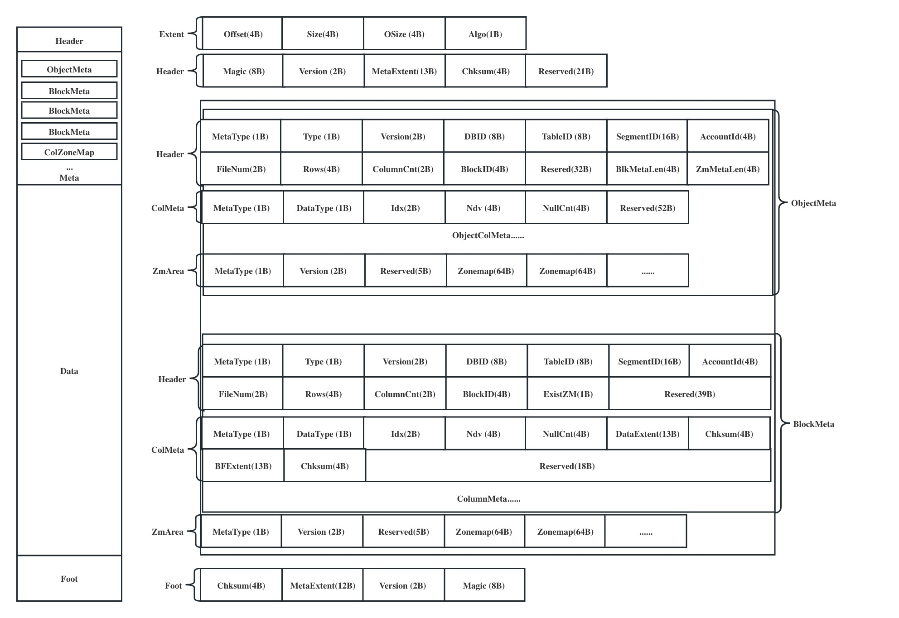
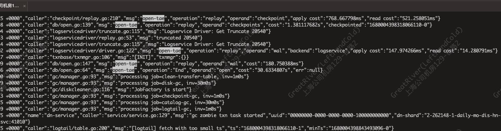
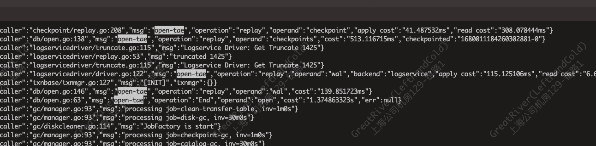

# MatrixOne Layout


MatrixOne从0.5设计开始就已经确定采用列存结构来存储数据集，原因如下：
```go
1.很容易对AP优化

2.通过引入Column Family的概念可以对负载灵活适配。假如所有列都是一个Column Family，
也就是所有的列数据保存在一起，这就跟数据库的HEAP文件非常类似，可以表现出行存类似的行为，
典型的OLTP数据库如PostgreSQL就是基于HEAP来做的存储引擎。假如每个列都是独立的Column Family，
也就是每一列都独立存放，那么就是典型的列存。通过定义Column Family，用户可以方便地在行存和列存之间切换，这只需要在DDL表定义中指定即可。
```

结合MatrixOne的业务逻辑，围绕以下几点来设计MatrixOne的列存结构：
```go
4 支持各种业务类型的数据存储
1 简单方便的拿到元数据
2 从数据文件中重建MatrixOne的数据结构
3 支持版本控制
```

### Part 1 Layout需要满足的条件和解决了什么问题
设计一种Layout，首先要提出一个疑问。
```go
我们到底需要满足什么功能和需求？
```
对于MatrixOne来说，需要存储的数据类型有很多种，比如：数据库表数据、元数据、数据库业务trace log、查询结果的cache...
```go
功能1：支持存储MatrixOne所有的业务类型数据。
```
MatrixOne需对接S3或共享对象存储，每一个对象需要存储指定行数或Size的存储集，所以一个对象会存储多个IO单元（IOEntry），在此时我们称之为Block。
这些Block需要高效读取和管理，比如一个查询需要读取哪些Block，首先需要拿到Block的元数据并分析，然后再根据这些Block的元数据得到真正数据的存放地址并读取。
```go
功能2：便捷高效的元数据
```
当MatrixOne运行一段时间，客户需求不断增加，这时不得不修改当前的Layout。
```go
功能3：支持数据的版本兼容和控制
```
支持数据分析工具和添加Scrub任务
```go
功能4：支持从数据对象文件中重建MatrixOne的表结构
```
根据以上需求我们得出现有的Layout结构


### Part 2 解析这些结构
#### Extent
在
```
+------------+----------+-------------+-------------+
| Offset(4B) | Size(4B) |  OSize (4B) |  Algo (1B)  |
+------------+----------+-------------+-------------+

Extent Size = 13B
An extent records the address of a data/meta unit in the object
Offset = Offset of Metadata/ColumnData/BloomFilter
Size = Size of Metadata/ColumnData/BloomFilter
oSize = Original Metadata/ColumnData/BloomFilter size
Algo = Compression algorithm type for Data
```
#### ObjectMeta
为什么我们先介绍ObjectMeta而不是Header，因为MatrixOne的查询只会从这个ObjectMeta开始。
```
+---------+------------+---------------+-----------+--------------+
|Magic(8B)| Version(2B)|MetaExtent(13B)| Chksum(4B)| Reserved(21B)|
+---------+------------+---------------+-----------+--------------+

Header Size = 64B
Magic = Engine identity (0xFFFFFFFF)
Version = Object file version
MetaExtent = Extent of Metadata
Chksum = Metadata checksum
Reserved = 21 bytes reserved space
```
MatrixOne存在多种业务类型数据，比如数据库表数据、元数据、Trace等等。

### Part 1 支持各种业务类型的数据存储
MatrixOne存在多种业务类型数据，比如数据库表数据、元数据、Trace等等。


##### Type
```
+---------------+
|   MetaType    |
+---------------+
| * ObjectMeta  |
| * BlockMeta   |
| * ColumnData  |
| * ZoneMap     |
+---------------+

MetaType:       Meta enumeration type
ObjectMeta    = Object metadata
BlockMeta     = Block metadata (a batch is one block)
ColumnData    = Column data metadata
ZoneMap       = Zonemap metadata

+---------------+
|  ObjectType   |
|  (DataType)   |
+---------------+
| * Data        |
| * Checkpoint  |
| * GCMeta      |
| * ETL         |
| * QueryResult |
+---------------+

ObjectType:     Object enumeration type
Data          = Database data
Checkpoint    = Checkpoint data
GCMeta        = Metadata of Disk cleaner
ETL           = ETL data
QueryResult   = Cache data of frontend query results
```

#### Extent

```
+------------+----------+-------------+-------------+
| Offset(4B) | Size(4B) |  OSize (4B) |  Algo (1B)  |
+------------+----------+-------------+-------------+

Extent Size = 13B
An extent records the address of a data/meta unit in the object
Offset = Offset of Metadata/ColumnData/BloomFilter
Size = Size of Metadata/ColumnData/BloomFilter
oSize = Original Metadata/ColumnData/BloomFilter size
Algo = Compression algorithm type for Data
```

#### Header
```
+---------+------------+---------------+-----------+--------------+
|Magic(8B)| Version(2B)|MetaExtent(13B)| Chksum(4B)| Reserved(21B)|
+---------+------------+---------------+-----------+--------------+

Header Size = 64B
Magic = Engine identity (0xFFFFFFFF)
Version = Object file version
MetaExtent = Extent of Metadata
Chksum = Metadata checksum
Reserved = 21 bytes reserved space
```
#### Metadata Area

```
+----------------------------------------------------------------------------------------------+
|                                         <Object Meta>                                        |
+----------------------------------------------------------------------------------------------+
|                                         <BlockMeta-1>                                        |
+----------------------------------------------------------------------------------------------+
|                                         <BlockMeta-2>                                        |
+----------------------------------------------------------------------------------------------+
|                                          ..........                                          |
+----------------------------------------------------------------------------------------------+
|                                     <Block Zonemap Area>                                     |
+----------------------------------------------------------------------------------------------+
```
##### Object Meta
An object can only have one ObjectMeta item
ObjectMeta needs to be consistent with BlockMeta to reduce code duplication
```
+--------------+---------+---------+------------+-----------------+-------------+--------+
| MetaType(1B) | Type(1B)| DBID(8B)| TableID(8B)| SegmentID(16B)  |AccountID(4B)|Num(2B) |
+--------------+---------+----------------------+-----------------+----------------------+
| ColumnCnt(2B)| Rows(4B)|  BlkMetaLength(4B)   | ZmMetaLength(4B)|    Resered(32B)      |
+--------------+---------+----------------------+-----------------+----------------------+
| <Col1>|<Col2>|<Col3>|<Col4>|<Col5>|<Col6>|...
                          |
                          |
           +--------+------------+------------+-------------+
           | Ndv(4B)| NullCnt(4B)| Zonemap(64)| Resered(24B)|
           +--------+------------+------------+-------------+
           
           
           
+--------------+---------+-------------+------------+--------------+--------------+----------------+
| MetaType(1B) | Type(1B)| Version(2B) |  DBID(8B)  | TableID(8B)  |SegmentID(16B)| AccountID(4B)  |
+--------------+---------+-------------+------------+--------------+-------------------------------+
|    Num(2B)   | Rows(4B)|ColumnCnt(2B)| Resered(4B)| Resered(32B) |BlkMetaLen(4B)|ZmMetaLength(4B)|
+--------------+---------+-------------+------------+--------------+--------------+----------------+
| <Col1>|<Col2>|<Col3>|<Col4>|<Col5>|<Col6>|<Col7>|<Col8>|<Col9>|   .....   |Zonemap Area|
                          |                                          
                          |                                                      
+------------+--------+-------+-------+-----------+-------------+
|MetaType(1B)|Type(1B)|Idx(2B)|Ndv(4B)|NullCnt(4B)|Reserved(52B)|      
+------------+--------+-------+-------+-----------+-------------+
                                                                                                                                  
MetaType = 00
Type = Object enumeration type
Version = Object file version
DBID = Database id
TableID = Table id
SegmentID = Segment id
AccountID = Account id
Num = File number
Rows = How many rows are contained in object
ColumnCnt = The number of column in the object zonemap
BlkMetaLen = Length of block metada
ZmMetaLen = Length of block zonemap area

ObjectColMeta
MetaType = 02
Type = The data type of the Column
Idx = Column index
Ndv = How many distinct values in the column
NullCnt = How many Null values in the column
Reserved = 52B For consistency with Columnmeta

```
##### Block Meta Header
```
+---------------+---------------+----------------+----+----------------------+
| <BlockMeta-1> | <BlockMeta-2> |  <BlockMeta-3> |....| <Block Zonemap Area> |
+---------------+---------------+----------------+----+----------------------+
       |
       |
+----------------------------------------------------------------------------------------------------+
|                                              Header                                                |
+--------------+---------+-------------+------------+--------------+--------------+------------------+
| MetaType(1B) | Type(1B)| Version(2B) |  DBID(8B)  | TableID(8B)  |SegmentID(16B)|   AccountID(4B)  |
+--------------+---------+-------------+------------+--------------+---------------------------------+
|    Num(2B)   | Rows(4B)|ColumnCnt(2B)| BlockID(4B)| ExistZM(1B)  |           Reserved(39B)         |
+--------------+---------+-------------+------------+--------------+---------------------------------+
|                                             ColumnMeta                                             |
+----------------------------------------------------------------------------------------------------+
|                                             ColumnMeta                                             |
+----------------------------------------------------------------------------------------------------+
|                                             ColumnMeta                                             |
+----------------------------------------------------------------------------------------------------+
|                                             ..........                                             |
+----------------------------------------------------------------------------------------------------+

BlockMetaHeader Size = 92B (=ObjectMetaHeader size)
MetaType = 01
Type = Object enumeration type
Version = version of block data(vector)
DBID = Database id
TableID = Table id
SegmentID = Segment id
AccountID = Account id
Num = File number
Rows = How many rows are contained in object
ColumnCnt = The number of column in the block
BlockID = Block id
ExistZM = Whether to write zonemap
```
##### Column Meta
```
+--------------------------------------------------------------------------------+
|                                  DataColumnMeta                                |
+-------------+----------+-------+-------+-----------+---------------+-----------+
|MetaType(1B) |Type(1B)  |Idx(2B)|Ndv(4B)|NullCnt(4B)|DataExtent(13B)|Chksum(4B) |    
+-------------+----------+-------+-------+-----------+---------------+-----------+
|BFExtent(13B)|Chksum(4B)|                     Reserved(18B)                     |
+-------------+----------+-------+-------+-----------+---------------+-----------+

ColumnMeta Size = 64B
MetaType = 02
Type = The data type of the Column
Idx = Column index
Ndv = How many distinct values in the column
NullCnt = How many Null values in the column
DataExtent = Exten of Column Data
Chksum = Column Data checksum
BFExtent = Exten of BloomFilter
```
##### Foot
```
+----------+----------------+-----------+----------+
|Chksum(4B)| MetaExtent(13B)|Version(2B)| Magic(8B)|
+----------+----------------+-----------+----------+

Magic = Engine identity (0x0xFFFFFFFF)
Version = Object file version
MetaExtent = Extent of Metadata
Chksum = Metadata checksum
```

## File Name Rules
```
<AccountID>/<DBID>/<TableID>/<SegmentID>-<FileName>

5/1001/1000/731f001d-55df-4f66-8ef7-10506b5bb4b3-0 

+-----------+-------+---------+-------------------------------------+----------+
|<AccountID>| <DBID>|<TableID>|       <SegmentID>                   | <FileNum>|
+-----------+-------+---------+-------------------------------------+----------+
|         5/|  1001/|    1000/| 731f001d-55df-4f66-8ef7-10506b5bb4b3| - 0      |
------------+-------+---------+-------------------------------------+----------+
```

## Data Structure
The Data area is composed of batches. 

Writing a batch means adding a block to the object, 
and the BlockID is generated in the order of writing.
### Appendable Block
#### Schema
```
+------------------+-------------+------------+
|Col1|Col2|Col3|...|   CommitTs  |  Aborted   |
+------------------+-------------+------------+
|        ...       |   Type.TS   |types.T_bool|
+------------------+-------------+------------+

Col1/Col2/Col3... = Original table column
CommitTs          = Commit timestamp
Aborted           = Whether to be aborted
```
### Delete Block
#### Schema
```
+------------------+-------------+------------+-------------+
|      RowID       |   CommitTs  |  Aborted   | PrimaryKey  |
+------------------+-------------+------------+-------------+
|  Type.T_Rowid    |  Type.T_TS  |types.T_bool| types.T_any |             
+------------------+-------------+------------+-------------+

RowID             = ID of the deleted row
CommitTs          = The commit timestamp of the delete operation
Aborted           = Whether the delete operation was aborted
```
## Index Structure
### Zone Map
```
+--------------+-------------+-------+------+
|      min     |     max     | flags | type |
+--------------+-------------+-------+------+
|         0,1,2,3......      |   62  |  63  |
+--------------+-------------+-------+------+

Zonemap Length  =  64 bytes
```
## IO Path
#### Read block
```
          +-------------------+
          |     MetaLoction   |
          +-------------------+                   
                    |
                    |
+--------------------------------------------------------------------+
|                             IO Entry                               |
+--------------------------------------------------------------------+
|        Meta(ObjectMeta/BlockMetaHeader/ColumnMeta/ZoneMap)         |
+--------+----------------+----------------+----------------+--------+
| Block  | <ColumnMeta-1> | <ColumnMeta-2> | <ColumnMeta-3> | ...... |
+--------+----------------+----------------+----------------+--------+
                  |               |               |
                  |               |               |
            +----------+    +----------+    +----------+
            | IO Entry |    | IO Entry |    | IO Entry |  
            +----------+    +----------+    +----------+
            |ColumnData|    |ColumnData|    |ColumnData|
            +----------+    +----------+    +----------+
```
#### Read object
```
          +-----------------------------+
          |           IO Entry          |
          +-----------------------------+  
                          |
                          |
+--------------------------------------------------------------------+
|                       Header & MetaExtent                          |
+--------------------------------------------------------------------+
|        Meta(ObjectMeta/BlockMetaHeader/ColumnMeta/ZoneMap)         |
+--------+----------------+----------------+----------------+--------+
| Block  | <ColumnMeta-1> | <ColumnMeta-2> | <ColumnMeta-3> | ...... |
+--------+----------------+----------------+----------------+--------+
                  |               |               |
                  |               |               |
            +----------+    +----------+    +----------+
            | IO Entry |    | IO Entry |    | IO Entry |  
            +----------+    +----------+    +----------+
            |ColumnData|    |ColumnData|    |ColumnData|
            +----------+    +----------+    +----------+
```

## Prefetch
#### Prefetch context
```
// Build the context of a prefetch request
BuildPrefetch(info []catalog.BlockInfo) prefetch

// Add a read block request to the prefetch context
AddBlock(idxes []uint16, ids []uint32)

```
#### Prefetch interface
```
// The caller has merged the block information that needs to be prefetched
PrefetchWithMerged(pref prefetch) error

// Simple prefetch a block
Prefetch(idxes []uint16,ids []uint32, info []catalog.BlockInfo) error

PrefetchMeta(info []catalog.BlockInfo) error
```

#### Prefetch case
```go

case 1:
// Build prefetch context
pref := BuildPrefetch(info)
idxes := []uint16{0, 2, 4}
ids1 := []uint32{0, 2}
pref.AddBlock(idxes, ids1)
ids2 := []uint32{1, 3}
pref.AddBlock(idxes, ids2)

// Exec prefetch
err := PrefetchWithMerged(pref)

case 2:
idxes1 := []uint16{0, 2, 4}
ids1 := []uint32{0, 2}
err = Prefetch(idxes1, ids1, info)

idxes2 := []uint16{1, 2}
ids2 := []uint32{1, 3}
err = Prefetch(idxes2, ids2, info)
```
##### before

##### after
