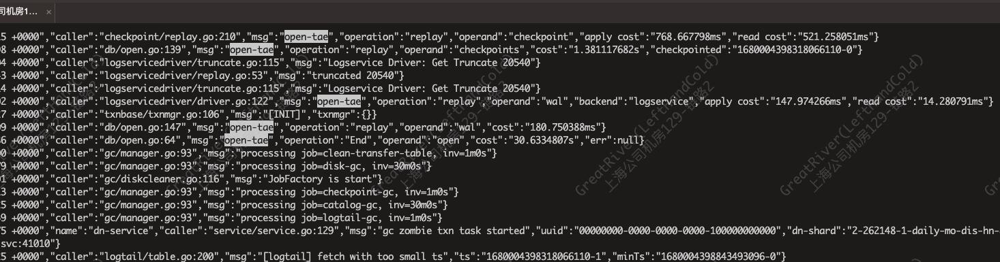

# Layout Reference
- [Format](layout.md#format)
  - [Type](layout.md#type)
  - [Extent](layout.md#extent)
  - [Header](layout.md#header)
  - [Metadata Area](layout.md#metadata-area)
  - [Object Meta](layout.md#object-meta)
  - [Block Meta](layout.md#block-meta-header)
- [File Name Rules](layout.md#file-name-rules)
- [Data Structure](layout.md#data-structure)
  - [Appendable Block](layout.md#appendable-block)
  - [Delete Block](layout.md#delete-block)
- [Index Structure](layout.md#index-structure)
  - [Zone Map](layout.md#zone-map)
- [IO Path](layout.md#io-path)
  - [Block](layout.md#read-block)
  - [Object](layout.md#read-block)
- [Prefetch](layout.md#prefetch)
##  Format
### Storage File Format

##### Type
```
+---------------+
|   MetaType    |
+---------------+
| * ObjectMeta  |
| * BlockMeta   |
| * ColumnData  |
| * ZoneMap     |
+---------------+

MetaType:       Meta enumeration type
ObjectMeta    = Object metadata
BlockMeta     = Block metadata (a batch is one block)
ColumnData    = Column data metadata
ZoneMap       = Zonemap metadata

+---------------+
|  ObjectType   |
|  (DataType)   |
+---------------+
| * Data        |
| * Checkpoint  |
| * GCMeta      |
| * ETL         |
| * QueryResult |
+---------------+

ObjectType:     Object enumeration type
Data          = Database data
Checkpoint    = Checkpoint data
GCMeta        = Metadata of Disk cleaner
ETL           = ETL data
QueryResult   = Cache data of frontend query results
```

#### Extent

```
+------------+----------+-------------+-------------+
| Offset(4B) | Size(4B) |  OSize (4B) |  Algo (1B)  |
+------------+----------+-------------+-------------+

Extent Size = 13B
An extent records the address of a data/meta unit in the object
Offset = Offset of Metadata/ColumnData/BloomFilter
Size = Size of Metadata/ColumnData/BloomFilter
oSize = Original Metadata/ColumnData/BloomFilter size
Algo = Compression algorithm type for Data
```

#### Header
```
+---------+------------+---------------+-----------+--------------+
|Magic(8B)| Version(2B)|MetaExtent(13B)| Chksum(4B)| Reserved(21B)|
+---------+------------+---------------+-----------+--------------+

Header Size = 64B
Magic = Engine identity (0xFFFFFFFF)
Version = Object file version
MetaExtent = Extent of Metadata
Chksum = Metadata checksum
Reserved = 21 bytes reserved space
```
#### Metadata Area

```
+----------------------------------------------------------------------------------------------+
|                                         <Object Meta>                                        |
+----------------------------------------------------------------------------------------------+
|                                         <BlockMeta-1>                                        |
+----------------------------------------------------------------------------------------------+
|                                         <BlockMeta-2>                                        |
+----------------------------------------------------------------------------------------------+
|                                          ..........                                          |
+----------------------------------------------------------------------------------------------+
|                                     <Block Zonemap Area>                                     |
+----------------------------------------------------------------------------------------------+
```
##### Object Meta
An object can only have one ObjectMeta item
```
+--------------+---------+---------+------------+-----------------+-------------+--------+
| MetaType(1B) | Type(1B)| DBID(8B)| TableID(8B)| SegmentID(16B)  |AccountID(4B)|Num(2B) |
+--------------+---------+----------------------+-----------------+----------------------+
| ColumnCnt(2B)| Rows(4B)|  BlkMetaLength(4B)   | ZmMetaLength(4B)|    Resered(32B)      |
+--------------+---------+----------------------+-----------------+----------------------+
| <Col1>|<Col2>|<Col3>|<Col4>|<Col5>|<Col6>|...
                          |
                          |
           +--------+------------+------------+-------------+
           | Ndv(4B)| NullCnt(4B)| Zonemap(64)| Resered(24B)|
           +--------+------------+------------+-------------+
                                     
MetaType = 00
Type = Object enumeration type
DBID = Database id
TableID = Table id
SegmentID = Segment id
AccountID = Account id
Num = File number
Rows = How many rows are contained in object
ColumnCnt = The number of column in the object zonemap
BlkMetaExtent = Extent of block metada
ZmMetaExtent = Extent of block zonemap area

Ndv = How many distinct values in the column
NullCnt = How many Null values in the column
Zonemap = Contains tow 32B values: min and max

```
##### Block Meta Header
```
+---------------+---------------+----------------+----+----------------------+
| <BlockMeta-1> | <BlockMeta-2> |  <BlockMeta-3> |....| <Block Zonemap Area> |
+---------------+---------------+----------------+----+----------------------+
       |
       |
+----------------------------------------------------------------------------------------------------+
|                                              Header                                                |
+------------+--------+-----------+-----------+-------------+-----------+----------------------------+
|MetaType(1B)|Type(1B)|Version(2B)|BlockID(4B)|ColumnCnt(2B)|ExistZM(1B)|        Reserved(21B)       |
+------------+--------+-----------+-----------+-------------+-----------+----------------------------+
|                                             ColumnMeta                                             |
+----------------------------------------------------------------------------------------------------+
|                                             ColumnMeta                                             |
+----------------------------------------------------------------------------------------------------+
|                                             ColumnMeta                                             |
+----------------------------------------------------------------------------------------------------+
|                                             ..........                                             |
+----------------------------------------------------------------------------------------------------+

BlockMetaHeader Size = 32B
MetaType = 01
Type = Object enumeration type
Version = version of block data(vector)
BlockID = Block id
ColumnCnt = The number of column in the block
ExistZM = Whether to write zonemap
```
##### Column Meta
```
+------------------------------------------------------------------------------------------------------+
|                                            DataColumnMeta                                            |
+-------------+--------+--------+----------------+----------+----------------+----------+--------------+
|MetaType(1B) |Type(1B)| Idx(2B)| DataExtent(13B)|Chksum(4B)|  BFExtent(13B) |Chksum(4B)| Reserved(26B)|
+-------------+--------+--------+----------------+----------+----------------+----------+--------------+

ColumnMeta Size = 64B
MetaType = 02
Type = The data type of the Column
Idx = Column index
DataExtent = Exten of Column Data
Chksum = Column Data checksum
BFExtent = Exten of BloomFilter
```
##### Foot
```
+----------+----------------+-----------+----------+
|Chksum(4B)| MetaExtent(13B)|Version(2B)| Magic(8B)|
+----------+----------------+-----------+----------+

Magic = Engine identity (0x0xFFFFFFFF)
Version = Object file version
MetaExtent = Extent of Metadata
Chksum = Metadata checksum
```

## File Name Rules
```
<AccountID>/<DBID>/<TableID>/<SegmentID>-<FileName>

5/1001/1000/731f001d-55df-4f66-8ef7-10506b5bb4b3-0 

+-----------+-------+---------+-------------------------------------+----------+
|<AccountID>| <DBID>|<TableID>|       <SegmentID>                   | <FileNum>|
+-----------+-------+---------+-------------------------------------+----------+
|         5/|  1001/|    1000/| 731f001d-55df-4f66-8ef7-10506b5bb4b3| - 0      |
------------+-------+---------+-------------------------------------+----------+
```

## Data Structure
The Data area is composed of batches. 

Writing a batch means adding a block to the object, 
and the BlockID is generated in the order of writing.
### Appendable Block
#### Schema
```
+------------------+-------------+------------+
|Col1|Col2|Col3|...|   CommitTs  |  Aborted   |
+------------------+-------------+------------+
|        ...       |   Type.TS   |types.T_bool|
+------------------+-------------+------------+

Col1/Col2/Col3... = Original table column
CommitTs          = Commit timestamp
Aborted           = Whether to be aborted
```
### Delete Block
#### Schema
```
+------------------+-------------+------------+
|      RowID       |   CommitTs  |  Aborted   |
+------------------+-------------+------------+
|  Type.T_Rowid    |  Type.T_TS  |types.T_bool|
+------------------+-------------+------------+

RowID             = ID of the deleted row
CommitTs          = The commit timestamp of the delete operation
Aborted           = Whether the delete operation was aborted
```
## Index Structure
### Zone Map
```
+--------------+-------------+-------+------+
|      min     |     max     | flags | type |
+--------------+-------------+-------+------+
|         0,1,2,3......      |   62  |  63  |
+--------------+-------------+-------+------+

Zonemap Length  =  64 bytes
```
## IO Path
#### Read block
```
          +-------------------+
          |     MetaLoction   |
          +-------------------+                   
                    |
                    |
+--------------------------------------------------------------------+
|                             IO Entry                               |
+--------------------------------------------------------------------+
|        Meta(ObjectMeta/BlockMetaHeader/ColumnMeta/ZoneMap)         |
+--------+----------------+----------------+----------------+--------+
| Block  | <ColumnMeta-1> | <ColumnMeta-2> | <ColumnMeta-3> | ...... |
+--------+----------------+----------------+----------------+--------+
                  |               |               |
                  |               |               |
            +----------+    +----------+    +----------+
            | IO Entry |    | IO Entry |    | IO Entry |  
            +----------+    +----------+    +----------+
            |ColumnData|    |ColumnData|    |ColumnData|
            +----------+    +----------+    +----------+
```
#### Read object
```
          +-----------------------------+
          |           IO Entry          |
          +-----------------------------+  
                          |
                          |
+--------------------------------------------------------------------+
|                       Header & MetaExtent                          |
+--------------------------------------------------------------------+
|        Meta(ObjectMeta/BlockMetaHeader/ColumnMeta/ZoneMap)         |
+--------+----------------+----------------+----------------+--------+
| Block  | <ColumnMeta-1> | <ColumnMeta-2> | <ColumnMeta-3> | ...... |
+--------+----------------+----------------+----------------+--------+
                  |               |               |
                  |               |               |
            +----------+    +----------+    +----------+
            | IO Entry |    | IO Entry |    | IO Entry |  
            +----------+    +----------+    +----------+
            |ColumnData|    |ColumnData|    |ColumnData|
            +----------+    +----------+    +----------+
```

## Prefetch
#### Prefetch context
```
// Build the context of a prefetch request
BuildPrefetch(reader dataio.Reader, m *mpool.MPool) prefetch

// Add a read block request to the prefetch context
AddBlock(idxes []uint16, ids []uint32)

```
#### Prefetch interface
```
// The caller has merged the block information that needs to be prefetched
PrefetchWithMerged(pref prefetch) error

// Simple prefetch a block
Prefetch(idxes []uint16,ids []uint32, reader dataio.Reader, m *mpool.MPool) error
```

#### Prefetch case
```go
reader, err := dataio.NewDataReader(fileservice, MetaLocation)

case 1:
// Build prefetch context
pref := BuildPrefetch(reader, mpool)
idxes := []uint16{0, 2, 4}
ids1 := []uint32{0, 2}
pref.AddBlock(idxes, ids1)
ids2 := []uint32{1, 3}
pref.AddBlock(idxes, ids2)

// Exec prefetch
err := PrefetchWithMerged(pref)

case 2:
idxes1 := []uint16{0, 2, 4}
ids1 := []uint32{0, 2}
err = Prefetch(idxes1, ids1, reader, mpool)

idxes2 := []uint16{1, 2}
ids2 := []uint32{1, 3}
err = Prefetch(idxes2, ids2, reader, mpool)
```
##### before

##### after
