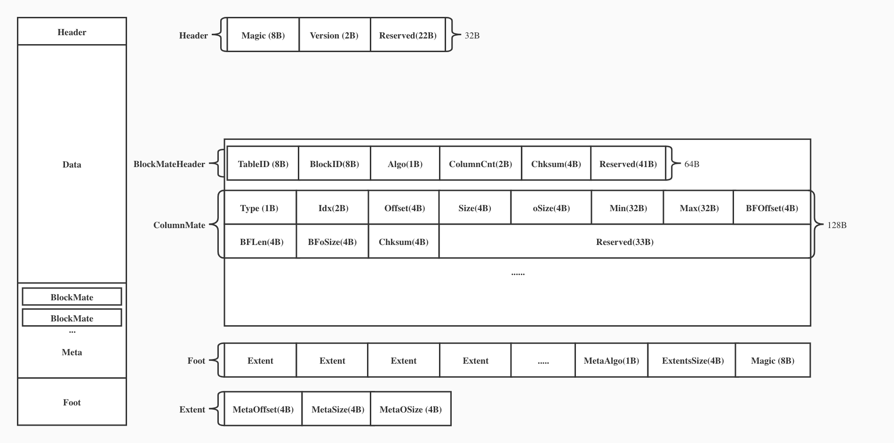

# Layout

## Storage File Format



### Extent

```
+------------+----------+-------------+
| Offset(4B) | Size(4B) |  OSize (4B) |
+------------+----------+-------------+

Extent Size = 12B
An extent records the address of a data/meta unit in the object
Offset = Offset of Metadata/ColumnData/BloomFilter
Size = Size of Metadata/ColumnData/BloomFilter
oSize = Original Metadata/ColumnData/BloomFilter size
```

### Header
```
+---------+------------+----------+---------------+-----------+--------------+
|Magic(8B)| Version(2B)| Algo(1B) |MetaExtent(12B)| Chksum(4B)| Reserved(22B)|
+---------+------------+----------+---------------+-----------+--------------+

Header Size = 64B
Magic = Engine identity (0x01346616). TAE only
Version = Object file version
Algo = Compression algorithm type for Metadata
MetaExtent = Extent of Metadata
Chksum = Metadata checksum
Reserved = 21 bytes reserved space
```
### Meta
```
+----------------------------------------------------------------------------------------------+
|                                         <Object Meta>                                        |
+----------------------------------------------------------------------------------------------+
|                                         <BlockMeta-1>                                        |
+----------------------------------------------------------------------------------------------+
|                                         <BlockMeta-2>                                        |
+----------------------------------------------------------------------------------------------+
|                                          ..........                                          |
+----------------------------------------------------------------------------------------------+
|                                     <Block Zonemap Area>                                     |
+----------------------------------------------------------------------------------------------+


```

##### Object Meta
```
+--------------+---------+--------------+-------------+-------+------+------+---+
| MetaType(1B) | Rows(4B)| ColumnCnt(2B)| Resered(25B)| <Col1>|<Col2>|<Col3>|...|
+--------------+---------+--------------+-------------+-------+------+------+---+
                                                           |
                                                           |
                                     +--------+------------+------------+-------------+
                                     | Ndv(4B)| NullCnt(4B)| Zonemap(64)| Resered(24B)|
                                     +--------+------------+------------+-------------+
                                     
MetaType = Metadata type
Rows = How many rows are contained in object
Ndv = How many distinct values in the column
NullCnt = How many Null values in the column
Zonemap = Contains tow 32B values: min and max

```
##### Block Meta Header
```
+---------------+---------------+----------------+----+----------------------+
| <BlockMeta-1> | <BlockMeta-2> |  <BlockMeta-3> |....| <Block Zonemap Area> |
+---------------+---------------+----------------+----+----------------------+
       |
       |
+----------------------------------------------------------------------------------------------------+
|                                              Header                                                |
+-------------+-----------+-------------+-----------+--------------+-----------------+---------------+
|MetaType(1B) |TableID(8B)|SegmentID(8B)|BlockID(4B)| ColumnCnt(2B)|ExistZonemap(1B) |Reserved(40B)  |
+-------------+-----------+-------------+-----------+--------------+-----------------+---------------+
|                                             ColumnMeta                                             |
+----------------------------------------------------------------------------------------------------+
|                                             ColumnMeta                                             |
+----------------------------------------------------------------------------------------------------+
|                                             ColumnMeta                                             |
+----------------------------------------------------------------------------------------------------+
|                                             ..........                                             |
+----------------------------------------------------------------------------------------------------+

BlockMetaHeader Size = 64B
MetaType = Metadata type
TableID = Table ID for Block
SegmentID = Segment ID
BlockID = Block ID
ColumnCnt = The number of column in the block
ExistZonemap = Whether each column in the block has a zonemap
Reserved = 41 bytes reserved space
```
##### Column Meta
```
+-----------------------------------------------------------------------------------------+
|                                       ColumnMeta                                        |
+--------+--------+--------+----------------+----------+----------------------+-----------+
|Type(1B)|Algo(1B)| Idx(2B)| DataExtent(12B)|Chksum(4B)| BloomFilteExtent(12B)|Chksum(4B) |
+--------+--------+--------+----------------+----------+----------------------+-----------+
|                                      Reserved(28B)                                      |
+-----------------------------------------------------------------------------------------+
ColumnMeta Size = 128B
Type = The data type of the Column
Idx = Column index
DataExtent = Exten of Column Data
Chksum = Column Data checksum

BFoffset = Bloomfilter data offset
Bflen = Bloomfilter data size
BFoSize = Bloomfilter original data size
Chksum = Data checksum
Reserved = 28 bytes reserved space
```
##### Foot
```
+----------+----------------+----------+-----------+----------+
|Chksum(4B)| MetaExtent(12B)| Algo(1B) |Version(2B)| Magic(8B)|
+----------+----------------+----------+-----------+----------+
Magic = Engine identity (0x01346616). TAE only
Version = Object file version
Algo = Compression algorithm type for Metadata
MetaExtent = Extent of Metadata
Chksum = Metadata checksum
```

### IO Path
##### Read block
```
          +-------------------+
          |     MetaLoction   |
          +-------------------+                   
                    |
                    |
+--------------------------------------------------------------------+
|                             IO Entry                               |
+--------------------------------------------------------------------+
|        Meta(ObjectMeta/BlockMetaHeader/ColumnMeta/ZoneMap)         |
+--------+----------------+----------------+----------------+--------+
| Block  | <ColumnMeta-1> | <ColumnMeta-2> | <ColumnMeta-3> | ...... |
+--------+----------------+----------------+----------------+--------+
                  |               |               |
                  |               |               |
            +----------+    +----------+    +----------+
            | IO Entry |    | IO Entry |    | IO Entry |  
            +----------+    +----------+    +----------+
            |ColumnData|    |ColumnData|    |ColumnData|
            +----------+    +----------+    +----------+
```
##### Read object
```
          +-----------------------------+
          |            Header           |
          +--------+-------------+------+  
          | ...... | MetaExtent  |......|
          +--------+-------------+------+
                          |
                          |
+--------------------------------------------------------------------+
|                             IO Entry                               |
+--------------------------------------------------------------------+
|        Meta(ObjectMeta/BlockMetaHeader/ColumnMeta/ZoneMap)         |
+--------+----------------+----------------+----------------+--------+
| Block  | <ColumnMeta-1> | <ColumnMeta-2> | <ColumnMeta-3> | ...... |
+--------+----------------+----------------+----------------+--------+
                  |               |               |
                  |               |               |
            +----------+    +----------+    +----------+
            | IO Entry |    | IO Entry |    | IO Entry |  
            +----------+    +----------+    +----------+
            |ColumnData|    |ColumnData|    |ColumnData|
            +----------+    +----------+    +----------+
```