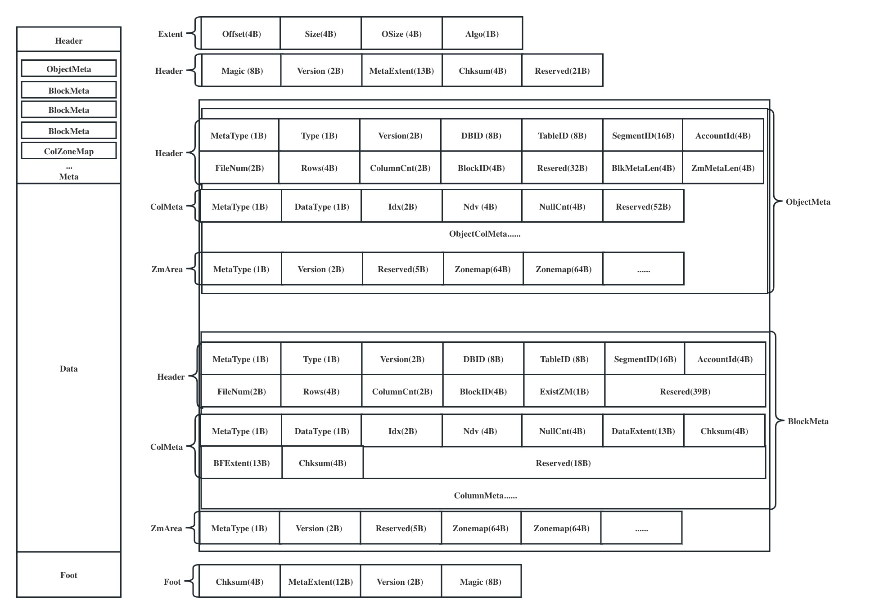

# Layout Reference

## Storage File Format



## Protos

### Extent

```
+------------+----------+-------------+-------------+
| Offset(4B) | Size(4B) |  OSize (4B) |  Algo (1B)  |
+------------+----------+-------------+-------------+

Extent Size = 12B
An extent records the address of a data/meta unit in the object
Offset = Offset of Metadata/ColumnData/BloomFilter
Size = Size of Metadata/ColumnData/BloomFilter
oSize = Original Metadata/ColumnData/BloomFilter size
Algo = Compression algorithm type for Data
```

### Header
```
+---------+------------+---------------+-----------+--------------+
|Magic(8B)| Version(2B)|MetaExtent(13B)| Chksum(4B)| Reserved(21B)|
+---------+------------+---------------+-----------+--------------+

Header Size = 64B
Magic = Engine identity (0x01346616). TAE only
Version = Object file version
MetaExtent = Extent of Metadata
Chksum = Metadata checksum
Reserved = 21 bytes reserved space
```
### Metadata Area

```
+----------------------------------------------------------------------------------------------+
|                                         <Object Meta>                                        |
+----------------------------------------------------------------------------------------------+
|                                         <BlockMeta-1>                                        |
+----------------------------------------------------------------------------------------------+
|                                         <BlockMeta-2>                                        |
+----------------------------------------------------------------------------------------------+
|                                          ..........                                          |
+----------------------------------------------------------------------------------------------+
|                                     <Block Zonemap Area>                                     |
+----------------------------------------------------------------------------------------------+


```

##### Type
```
+---------------+
|   MetaType    |
+---------------+
| * ObjectMeta  |
| * BlockBatch  |
| * ColumnData  |
| * BloomFilter |
| * ZoneMap     |
+---------------+

MetaType:       Meta enumeration type
ObjectMeta    = Object metadata
BlockBatch    = Block metadata (a batch is a block)
ColumnData    = Column data metadata
BloomFilter   = Bloomfilter metadata
ZoneMap       = Zonemap metadata

+---------------+
|  ObjectType   |
|  (DataType)   |
+---------------+
| * Data        |
| * Checkpoint  |
| * GCMeta      |
| * ETL         |
| * QueryResult |
+---------------+

ObjectType:     Object enumeration type
Data          = Database data
Checkpoint    = Checkpoint data
GCMeta        = Metadata of Disk cleaner
ETL           = ETL data
QueryResult   = Cache data of frontend query results
```

##### Object Meta
An object can only have one ObjectMeta item
```
+--------------+---------+---------+------------+--------------+-------------+--------+
| MetaType(1B) | Type(1B)| DBID(8B)| TableID(8B)| SegmentID(4B)|AccountID(4B)|Rows(4B)|
+--------------+-------------------+---------------------------+-------------+--------+
| ColumnCnt(2B)| BlkMetaExtent(13B)|    ZmMetaExtent(13B)      |      Resered(24B)    |
+--------------+-------------------+---------------------------+----------------------+
| <Col1>|<Col2>|<Col3>|<Col4>|<Col5>|<Col6>|...
                          |
                          |
           +--------+------------+------------+-------------+
           | Ndv(4B)| NullCnt(4B)| Zonemap(64)| Resered(24B)|
           +--------+------------+------------+-------------+
                                     
MetaType = 00
Type = Object enumeration type
DBID = Database id
TableID = Table id
SegmentID = Segment id
AccountID = Account id
Rows = How many rows are contained in object
ColumnCnt = The number of column in the object zonemap
BlkMetaExtent = Extent of block metada
ZmMetaExtent = Extent of block zonemap area

Ndv = How many distinct values in the column
NullCnt = How many Null values in the column
Zonemap = Contains tow 32B values: min and max

```
##### Block Meta Header
```
+---------------+---------------+----------------+----+----------------------+
| <BlockMeta-1> | <BlockMeta-2> |  <BlockMeta-3> |....| <Block Zonemap Area> |
+---------------+---------------+----------------+----+----------------------+
       |
       |
+----------------------------------------------------------------------------------------------------+
|                                              Header                                                |
+------------+--------+-----------+-----------+-------------+-----------+--------------+-------------+
|MetaType(1B)|Type(8B)|Version(8B)|BlockID(4B)|ColumnCnt(2B)|ExistZM(1B)|BfColCount(2B)|Reserved(19B)|
+------------+--------+-----------+-----------+-------------+-----------+--------------+-------------+
|                                             ColumnMeta                                             |
+----------------------------------------------------------------------------------------------------+
|                                             ColumnMeta                                             |
+----------------------------------------------------------------------------------------------------+
|                                             ColumnMeta                                             |
+----------------------------------------------------------------------------------------------------+
|                                             ..........                                             |
+----------------------------------------------------------------------------------------------------+

BlockMetaHeader Size = 64B
MetaType = 01
Type = Object enumeration type
Version = version of block data(vector)
BlockID = Block id
ColumnCnt = The number of column in the block
ExistZM = Whether to write zonemap
BfColCount = The count of bloomfilter in the block
```
##### Column Meta
```
+--------------------------------------------------------------------------+
|                              DataColumnMeta                              |
+-------------+--------+--------+----------------+----------+--------------+
|MetaType(1B) |Type(1B)| Idx(2B)| DataExtent(12B)|Chksum(4B)| Reserved(11B)|
+-------------+--------+--------+----------------+----------+--------------+

ColumnMeta Size = 128B
MetaType = 02
Type = The data type of the Column
Idx = Column index
DataExtent = Exten of Column Data
Chksum = Column Data checksum

+-----------------------------------------------------------------------------+
|                                BloomFilterMeta                              |
+-------------+-----------+--------+----------------+----------+--------------+
|MetaType(1B) |Version(1B)| Idx(2B)| DataExtent(12B)|Chksum(4B)| Reserved(11B)|
+-------------+-----------+--------+----------------+----------+--------------+

MetaType = 03
Version = Bloomfilter version
Idx = Column index
DataExtent = Exten of Bloomfilter Data
Chksum = Bloomfilter Data checksum
```
##### Foot
```
+----------+----------------+-----------+----------+
|Chksum(4B)| MetaExtent(13B)|Version(2B)| Magic(8B)|
+----------+----------------+-----------+----------+
Magic = Engine identity (0x01346616). TAE only
Version = Object file version
MetaExtent = Extent of Metadata
Chksum = Metadata checksum
```

### IO Path
##### Read block
```
          +-------------------+
          |     MetaLoction   |
          +-------------------+                   
                    |
                    |
+--------------------------------------------------------------------+
|                             IO Entry                               |
+--------------------------------------------------------------------+
|        Meta(ObjectMeta/BlockMetaHeader/ColumnMeta/ZoneMap)         |
+--------+----------------+----------------+----------------+--------+
| Block  | <ColumnMeta-1> | <ColumnMeta-2> | <ColumnMeta-3> | ...... |
+--------+----------------+----------------+----------------+--------+
                  |               |               |
                  |               |               |
            +----------+    +----------+    +----------+
            | IO Entry |    | IO Entry |    | IO Entry |  
            +----------+    +----------+    +----------+
            |ColumnData|    |ColumnData|    |ColumnData|
            +----------+    +----------+    +----------+
```
##### Read object
```
          +-----------------------------+
          |            Header           |
          +--------+-------------+------+  
          | ...... | MetaExtent  |......|
          +--------+-------------+------+
                          |
                          |
+--------------------------------------------------------------------+
|                             IO Entry                               |
+--------------------------------------------------------------------+
|        Meta(ObjectMeta/BlockMetaHeader/ColumnMeta/ZoneMap)         |
+--------+----------------+----------------+----------------+--------+
| Block  | <ColumnMeta-1> | <ColumnMeta-2> | <ColumnMeta-3> | ...... |
+--------+----------------+----------------+----------------+--------+
                  |               |               |
                  |               |               |
            +----------+    +----------+    +----------+
            | IO Entry |    | IO Entry |    | IO Entry |  
            +----------+    +----------+    +----------+
            |ColumnData|    |ColumnData|    |ColumnData|
            +----------+    +----------+    +----------+
```